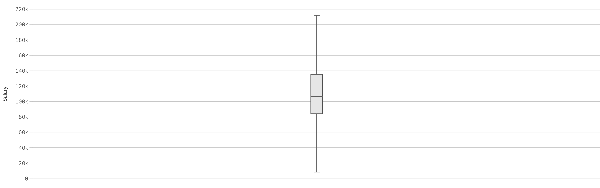
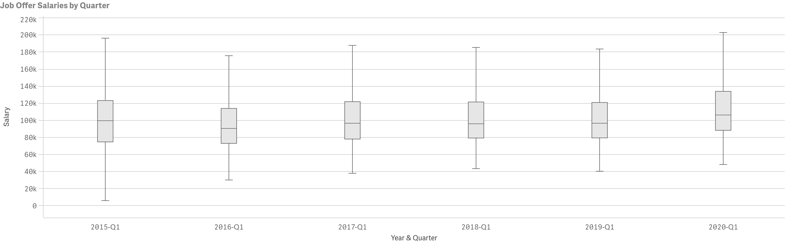
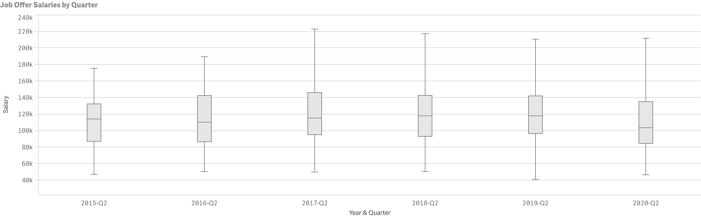
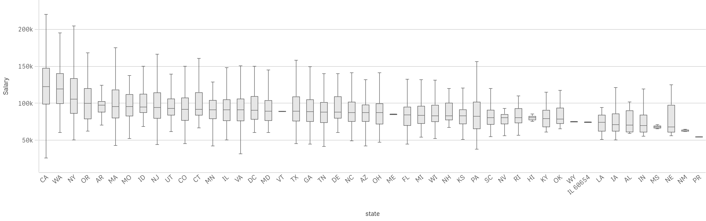
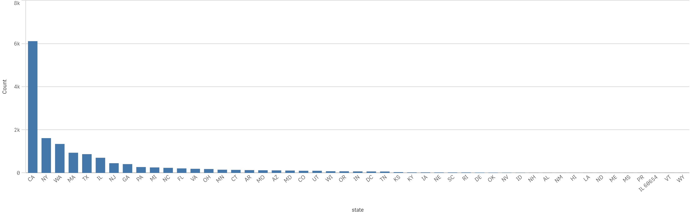
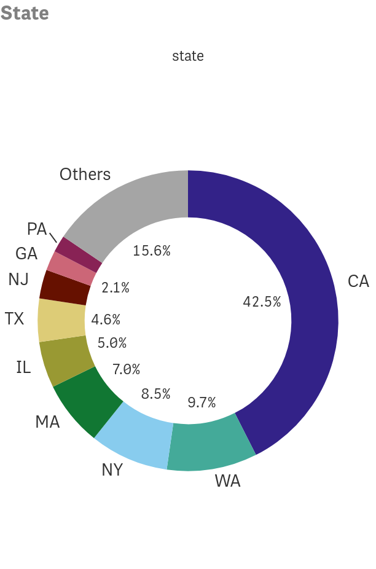
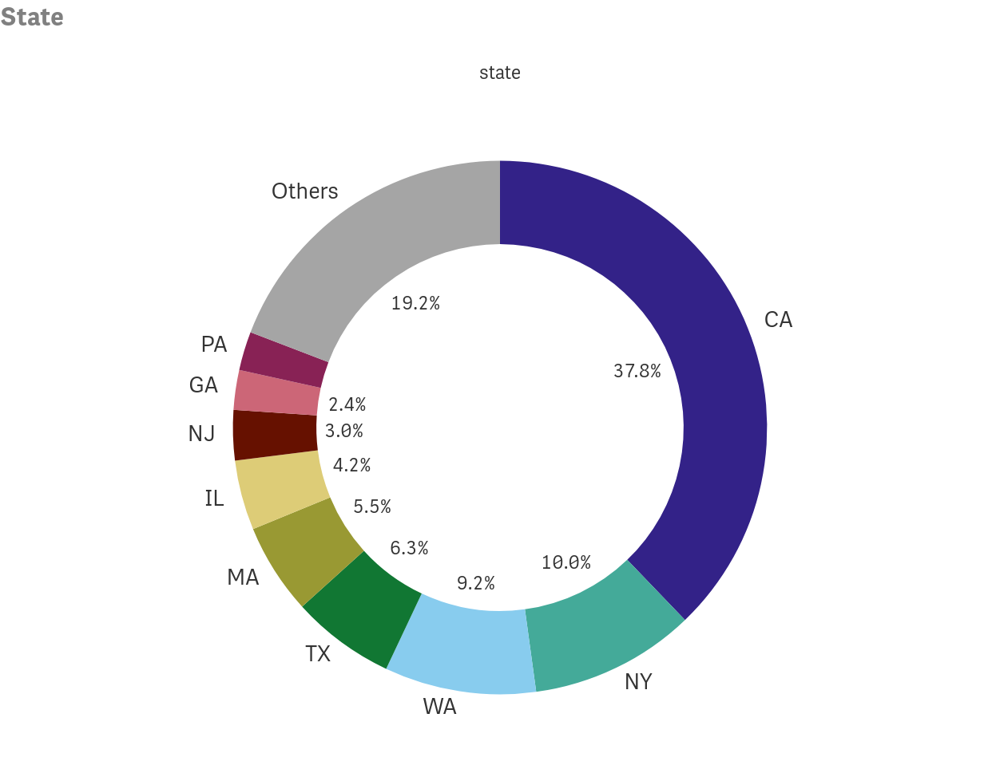
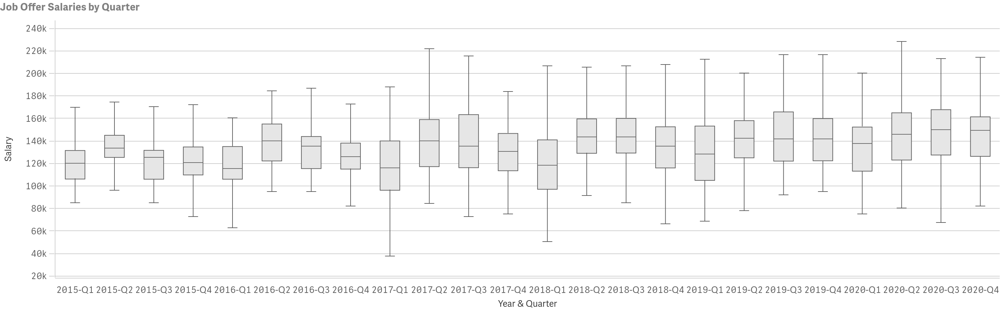

# Data Science Hiring Patterns

## Table of Contents
* [Overview](#overview)
* [Data](#Data)
* [Job Growth](#Job-Growth)
* [Salary](#Salary)
* [Locations](#Locations)
* [Big Companies](#Big-Companies)
* [References](#References)

## Overview

This project has two purposes. First, I would like to see what effect COVID-19 has had on data science job hiring in 2020. Second, I would like to gather some insight on when and where recent graduates should look in order to get their first job.

## Data

The data for this project was scraped from the website h1bdata.info using a webscraper that can be found on the following github page: https://github.com/mingen-pan/Scraping-H1B-visa-info (Thank you Mingen Pan!). The data consists of an individual's employer, location by state and city, salary, and the date that the offer was submitted.

## Job Growth

In this section, we will explore how job growth for data science has changed over time and where to look for jobs by state. To start our exploration we will start with the following plot that shows the number of jobs filled by year and quarter.

Ignoring the year 2020 for now, you'll notice that hiring spikes in the first quarter of every year and remaing positions are evenly split between the remaining quarters of the year. The spike in positions filled in the first quarter account for approximately 60% of all jobs filled in each year. It is also clear that the number of positions filled each year has been increasing. However, the pattern we see from 2015 through 2019 abruptly changes in 2020 when COVID-19 is introduced. Suddenly, a lot more positions have been filled in the second quarter compared to the previous years.

Since I only have data for the first three quarters of 2020, I will now verify that hiring has slowed down by looking at the total jobs hired for the first three quarters of the year.

Now that it's confirmed that hiring is down in 2020, I would like to know what kinds of positions were affected the most. Admittedly, I have a strong bias towards the theory that it was early career positions that were affected the most.

## Salary

To gather some insight on what happened in 2020, let's start by taking a look at a box plot of salaries to get an idea of how well data scientists are paid.

So the first quartile has a salary of 83k, the median is 104k and the third quartile is 133k. Now let's break this down by year and see how salaries have been changing.

In summary, from 2015 to 2016, the salaries went down in every quartile. Then salaries went up and remained steady from 2017 to 2018. Then an increasing trend appears where between 1 and 3 thousand dollars is added to the quartiles each year through 2020. It's difficult to look at these plots and say that anything strange happened. The small increases from 2019 to 2020 seem not that significant. Recall that 2020 is still missing it's 4th quarter which might be affecting the values of the quartiles.

There's a lot of information to make sense of in this last plot. First I would like to point out that the positions filled in 4th quarter tends to have a higher salary compared to earlier quarters, which means that the quartiles for 2020 in the plot above most likely appear lower than they should be.

Second, salaries in the first quarter of each year appear to be when salaries are at the lowest. I would interpret this to mean that the first quarter is when the most early career positions are filled. In 2020, however, the quartiles for salaries in the first quarter look much higher than the first quarters of previous years possibly indicating that this didn't happen.

Third, the quartiles in the second quarter of 2020 are much lower than the quartiles in the first quarter. This probably means that the early carerer positions that were traditionally filled in the first quarter were most likely pushed into the second quarter.

Let's turn our focus back onto the first quarter of each year and confirm the sharp uptick in salaries.

Now it should be easier to see that quartiles of salaries in the first quarter of 2020 are higher than in the first quarter of previous years by approxcimately 10k each. 

The most likely cause of this disruption is that the impact COVID-19 created uncertainty on how it would impact business and the training of new employeers. Now Let's examine the second quarters of each year and see how different it was from previous years:

Here we can see that the quartiles in the second quarter of 2020 are all down by about 13k compared to previous years. This appears to confirm that more early career positions were filled in this quarter. Since 2020 split a lot of positions between the first and second quarter, let's now combine the first and second quarter of each year and see how different the years appear.

With the two quarters combined we can see that the salary distribution for the combined first and second quarter in 2020 is still up compared to previous years by about 4k or more in each of the quartiles. Now let's combine all three quarters and see how the years compare. This way we are comparing the complete information of all years.

 We still see that the distribution for 2020 is up by about 4k in the first quartile, median, and third quartile compared to past years. So far I have been trying to conclude that early career positions weren't filled in 2020, but is there another possible explanation? Maybe the states and cities with the highest wages were hiring early career positions and that's why the salaries are seeing this boost. Let's now explore this idea 

## Locations

Let's first take a look at the distribution of salaries by states. The states will be organized by median salary in descending order.

Now let's take a look at how the share of hiring by state has changed.

2015:

2016:

2017:

2018:

2019:

2020:

Note that California, New York, and Washington, have the highest salaries and the most data scientists, but their share of the data scientists hired each year has been steadily shrinking. In total, the percentage has gone from 71% of all positions in 2015 to 56% of all positions in 2020. Given that the salaries in these other states are typically less, one would expect the salaries to be going down even though that wasn't the case. So perhaps, the reason that salaries are up is because the biggest companies are hiring fewer early career positions than they used to.

## Big Companies

Let's start by exploring 

Note that all of these companies', except IBM, have median salaries that are considerably higher the median salary of data scientists as a whole. Now that we've seen what the distribution of these salaries look like, let's take a look at how these salaries have changed over time.

These box plots show that the companies that hire the most data scientists have steadily been raising the salaries of their newest employees each year. 2020 in particular saw the largest increase in the median salary of their newest data scientists, with all quartiles up by 10k compared to the previous year. Now let's take a look at how many positions were filled in the first three quarters of each year.

In this plot we can see that just like that just like the economy as a whole, the number of Data Science positions filled was increasing rapidly until we get to 2020 where there is only a slight increase. Now you might be wondering if the hiring patterns for the top 10 companies matches the hiring pattern of all employers.

As we can see the pattern matches what we saw earlier. Most positions were filled in the first quarter and this was also when salaries were at their lowest. Let's see if that pattern continues here too.

Just as before, the salaries the distribution of salaries is lowest during the first quarter of each year and then higher for each quarter afterwards. It also appears that the salaries have been steadily increasing. Let's investigate this further by comparing the salaries only in the first quarter. 

 

What's interesting to note here is that the first quartile and median salaries of positions in 2020 are up by 10k compared to 2019 but even 2019 saw 7k, 7k, and 15k, increases in the first quartile, median, and third quartile compared to 2018, respectively.

So maybe the largest companies that hire data scientists fill or create as many early career positions  as they had in previous years. If enough larger data science companies continued this pattern, then maybe this is the reason that salaries are up in 2020.  

## References

1. The data used for this analysis was scraped from h1bdata.info

2. The scraper used was cloned from this github repositoryhttps://github.com/mingen-pan/Scraping-H1B-visa-info by Mingen Pan.