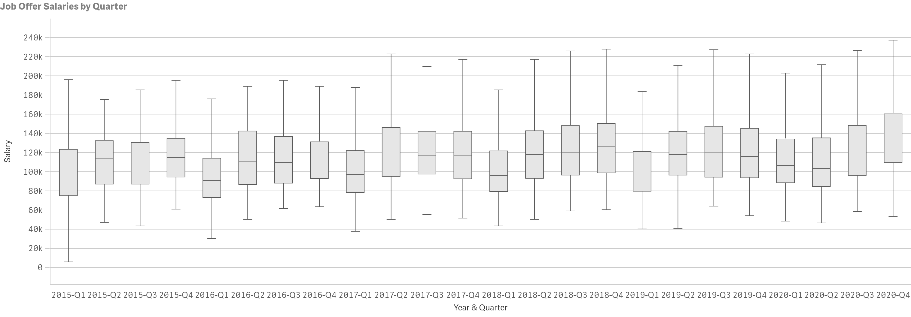
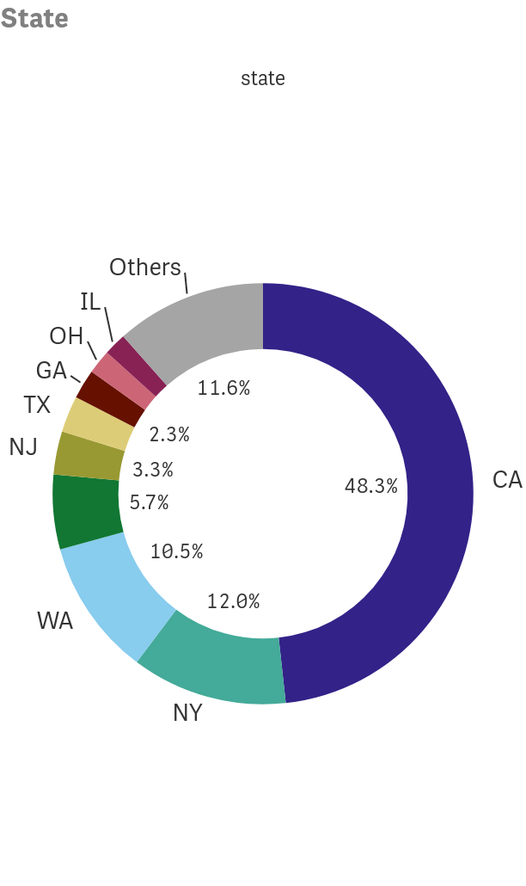

# Data Science Hiring Patterns

## Table of Contents
* [Overview](#overview)
* [Data](#Data)
* [Job Growth](#Job-Growth)
* [Salaries](#Salaries)
* [Locations](#Locations)
* [References](#References)

## Overview

This project has two purposes. First, I would like to see what effect COVID-19 has had on data science job hiring in 2020. Second, I would like to gather some insight on when the best time for recent graduates to try to get their first job.

## Data

The data for this project was scraped from the website h1bdata.info using a webscraper that can be found on the following github page: https://github.com/mingen-pan/Scraping-H1B-visa-info (Thank you Mingen Pan!). The data consists of an individuals employer, location by state and city, salary, and the date that the offer was submitted.

## Job Growth

The following plot shows the number of jobs filled by year and quarter

If you initially ignore the jobs filled in the year 2020 you'll notice see the seasonal effect that hiring spikes in the first quarter of every year and is typically even split for the remainder of the year. first quarter accounts for approximately 60% of all jobs filled in that year. You might also notice that the number of positions filled each year has been increasing year after year. However, if we no longer ignore 2020, then it is now self-evident that not only have hiring practices have changed. Usually hiring in second quarter is now considerably closer in size

Since I only have data for the first three quarters of 2020, I will now verify that hiring has slowed down by looking at the total jobs hired for the first three quarters of the year

So now that it's confirmed that hiring is down in 2020, it would be helpful to know where hiring has dropped the most. 

## Salaries

To gather some insight, let's take a look at salary distribution by quarter.

There's a lot of information to sift through in this last plot, but I think the main focus should be that hiring in the first quarter is usually when the salaries are the lowest for the year. From my perspective, this means that this is the time when the most early career employees are hired. However, in 2020, the distribiution for salaries in the first quarter in 2020 takes a major shift up. Let's take a closer look at the first quarters of each year for comparison.

Now it should clear that salaries are up in the first quarter. The first quartile, median, and third quartile are each up by about 10k. It could be that fewer early career individuals with the cause being that with the most likely culprit being COVID-19 and uncertainty in the economy. It could just be that hiring was shifted into the next quarter. Recall that a large number of applicants in 2020 were hired in the second quarter. Let's take a look at the salary distribution there:

Here we can see that the second quarter made up for a lot of the missing early career positions in the first quarter. The first quartile, median, and third quartile positions are all down by about 13k, which should be an indicator that more early career positions were filled during this time. However, there were also fewer positions in total for the second quarter so it would be useful to see how the combined first and second quarter box plots have effected salary distributions.

With the two quarters combined we can see that the salary distribution for the combined first and second quarter in 2020 is still up compared to previous years by about 4k or more in the first quartile, median, and third quartile. This probably means that early careers are down overall but perhaps not as much as much as the first quarter alone would suggest.

There is one more point to consider. If we look at the trend of job growth from the first three quarters of 2015 through 2019, then a simple linear regression predicts that there should have been 763 more jobs or about 22% more jobs than the total number of jobs that have been created from the first through third quarter of 2020.

## Locations

This last section is more for early career individuals who might want to be curious about what cities or states they should look to for jobs and not at all about how covid has disrupted job hiring in data science. 

2015:

2016:

2017:

2018:

2019:

2020:

and the following pie charts show which cities are hiring the most data scientists

2015:

2016:

2017:

2018:

2019:

2020:

## References

1. The data used for this analysis was scraped from h1bdata.info

2. The scraper used was cloned from this github repositoryhttps://github.com/mingen-pan/Scraping-H1B-visa-info by Mingen Pan.